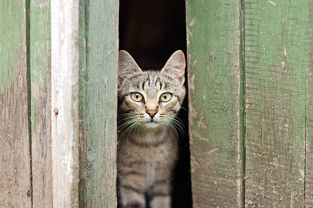

# Animal Farm

Animal Farm is the culmination of a multi-week lab that implements various c++ techniques in order to create databases of various animals.

Included in this program is the ability to do the following:
* Generate cats that contain information about their weight, gender, color, and name
* Store those cats into a singular linked list and access their data at-will
* Sort the linked list by the age of the addresses the cats are held on

Additionally, there is legacy implementation to store cats in a database without the use of c++ classes

###### Link to Project - 


### epicCats
epicCats.cpp was the first major executable created for the project, and uses arrays to store names, genders, and various other information of randomly-generated cats in an easily accessed manner. Additionally, it tests the ability to remove and replace cats in the database.

When run, the output will look similar to the following:
````
Name: Whiskey  
Gender: Male  
Weight: 50.17 lb  
Chip ID: 124dd4f4  
Is Fixed?: No  

Name: Cookie  
Gender: Female  
Weight: 26.98 lb  
Chip ID: 41f0defc  
Is Fixed?: Yes  

Name: Cheddar  
Gender: Male  
Weight: 37.22 lb  
Chip ID: 6f469d4f  
Is Fixed?: Yes  

...

Deleted and replaced Cat  
Name: Waffle    
Gender: Unknown  
Weight: 28.66 lb  
Chip ID: 2636b5d8  
Is Fixed?: Yes  
````
Once we began to use c++ in earnest, this code became obsolete and is now stored separately from the rest of the project as a whole

### catInfinitum
main_catInfinitum.cpp is the first of 3 c++ executables to demonstrate the ability to store cats in a linked list. It specifically is a basic demonstration of the ability to store and dump cat data.

The following is a sample of the output:
````
================================================================================
Object              class               SingleLinkedList                        
Object              this                0x7fff1f4144f0                          
container           count               10                                      
SingleLinkedList    headNode            0x55b473323960                          
================================================================================
================================================================================
Object              class               Cat                                     
Object              this                0x55b473323960                          
Node                next                0x55b4733238e0                          
Animal              kingdom             Animalia                                
Animal              weight              69.1349                                 
Mammal              classification      Mammalia                                
Mammal              color               Sorrel                                  
Mammal              gender              Unknown gender                          
Cat                 name                Grizzabella                             
================================================================================
Object              class               Cat                                     
Object              this                0x55b4733238e0                          
Node                next                0x55b473323860                          
Animal              kingdom             Animalia                                
Animal              weight              72.0973                                 
Mammal              classification      Mammalia                                
Mammal              color               Orange                                  
Mammal              gender              Unknown gender                          
Cat                 name                Tarasios                                
================================================================================
...
````

Originally the output was not as complicated and only referenced animals and mammals; however, due to future implementation of Class types, the code was updated in order to accommodate these changes. The Cat_Infinitum tag on GitHub has a snapshot of the code before this change was implemented if you are interested.

### Cat Wrangler

main_catWrangler.cpp is the second c++ executable, and demonstrates the ability to sort the cats in the database. currently, the list is sorted by the age of the addresses of each cat.

When run, the output will show the list pre- and post-sort. The following is an abridged version of said output:
````
================================================================================
Object              class               SingleLinkedList                        
Object              this                0x7fff9d386b60                          
container           count               10                                      
SingleLinkedList    headNode            0x56420dcd1960                          
================================================================================
================================================================================
Object              class               Cat                                     
Object              this                0x56420dcd1960                          
Node                next                0x56420dcd18e0                          
Animal              kingdom             Animalia                                
Animal              weight              71.2132                                 
Mammal              classification      Mammalia                                
Mammal              color               Calico                                  
Mammal              gender              Female                                  
Cat                 name                Mike                                    
================================================================================
Object              class               Cat                                     
Object              this                0x56420dcd18e0                          
Node                next                0x56420dcd1860                          
Animal              kingdom             Animalia                                
Animal              weight              25.7718                                 
Mammal              classification      Mammalia                                
Mammal              color               Red                                     
Mammal              gender              Unknown gender                          
Cat                 name                Nisie                                   
================================================================================
Object              class               Cat                                     
Object              this                0x56420dcd1860                          
Node                next                0x56420dcd17e0                          
Animal              kingdom             Animalia                                
Animal              weight              81.2232                                 
Mammal              classification      Mammalia                                
Mammal              color               Tortoiseshell                           
Mammal              gender              Unknown gender                          
Cat                 name                Boyce                                   
================================================================================
Object              class               Cat                                     
Object              this                0x56420dcd17e0                          
Node                next                0x56420dcd1760                          
Animal              kingdom             Animalia                                
Animal              weight              38.511                                  
Mammal              classification      Mammalia                                
Mammal              color               Lavender                                
Mammal              gender              Unknown gender                          
Cat                 name                Jolie                                   
================================================================================
Object              class               Cat                                     
Object              this                0x56420dcd1760                          
Node                next                0x56420dcd16e0                          
Animal              kingdom             Animalia                                
Animal              weight              52.6957                                 
Mammal              classification      Mammalia                                
Mammal              color               Ruddy                                   
Mammal              gender              Female                                  
Cat                 name                Varda                                   
================================================================================

...

================================================================================
Object              class               SingleLinkedList                        
Object              this                0x7fff9d386b60                          
container           count               10                                      
SingleLinkedList    headNode            0x56420dcd14e0                          
================================================================================
================================================================================
Object              class               Cat                                     
Object              this                0x56420dcd14e0                          
Node                next                0x56420dcd1560                          
Animal              kingdom             Animalia                                
Animal              weight              57.6437                                 
Mammal              classification      Mammalia                                
Mammal              color               Albino                                  
Mammal              gender              Female                                  
Cat                 name                Gemma                                   
================================================================================
Object              class               Cat                                     
Object              this                0x56420dcd1560                          
Node                next                0x56420dcd15e0                          
Animal              kingdom             Animalia                                
Animal              weight              83.9082                                 
Mammal              classification      Mammalia                                
Mammal              color               Sorrel                                  
Mammal              gender              Female                                  
Cat                 name                Keisha                                  
================================================================================
Object              class               Cat                                     
Object              this                0x56420dcd15e0                          
Node                next                0x56420dcd1660                          
Animal              kingdom             Animalia                                
Animal              weight              93.2699                                 
Mammal              classification      Mammalia                                
Mammal              color               Sandy                                   
Mammal              gender              Female                                  
Cat                 name                Ganessa                                 
================================================================================
Object              class               Cat                                     
Object              this                0x56420dcd1660                          
Node                next                0x56420dcd16e0                          
Animal              kingdom             Animalia                                
Animal              weight              85.7146                                 
Mammal              classification      Mammalia                                
Mammal              color               Sandy                                   
Mammal              gender              Unknown gender                          
Cat                 name                Huyana                                  
================================================================================
Object              class               Cat                                     
Object              this                0x56420dcd16e0                          
Node                next                0x56420dcd1760                          
Animal              kingdom             Animalia                                
Animal              weight              38.4293                                 
Mammal              classification      Mammalia                                
Mammal              color               Sorrel                                  
Mammal              gender              Female                                  
Cat                 name                Justice                                 
================================================================================
...
````

Similar to catInfinitum, the implementation of new classes resulted in this code being modified. The original version can be seen with the tag Cat_Wrangler

### Cat Empire
main_catEmpire.cpp is the final executable of the project, and demonstrates the ability to randomly pull information from cats in a linked list. This is when the cat class was created, resulting in a rewrite of all prior code.

When run, 100 cats will be inserted into a list, and 10 will randomly be chosen to output their info. The following is an example of the output:
````
catEmpire
The Cat named Zelpha at 0x55759d7f9e90 says Meow
The Cat named Zanzibar at 0x55759d7f9590 says Meow
The Cat named Roxanne at 0x55759d7f7b60 says Meow
The Cat named Bence at 0x55759d7f9e10 says Meow
The Cat named Haifa at 0x55759d7f7f60 says Meow
The Cat named Myles at 0x55759d7f9a90 says Meow
The Cat named Dash at 0x55759d7f6fe0 says Meow
The Cat named Zanzibar at 0x55759d7f9590 says Meow
The Cat named Nico at 0x55759d7f9f10 says Meow
The Cat named Albino at 0x55759d7f6f60 says Meow
````
The Cat_Empire tag contains a snapshot of the code at the time of the completion of this executable.

### Future Updates
Currently, there are unused variables and files that were not implemented due to time constraints. Examples include the ability to store left and right nodes in the Node class as well as the data files for Dog colors and names. These items allow for the potential future implementation of a Dog class, as well as the ability to create a binary tree container.